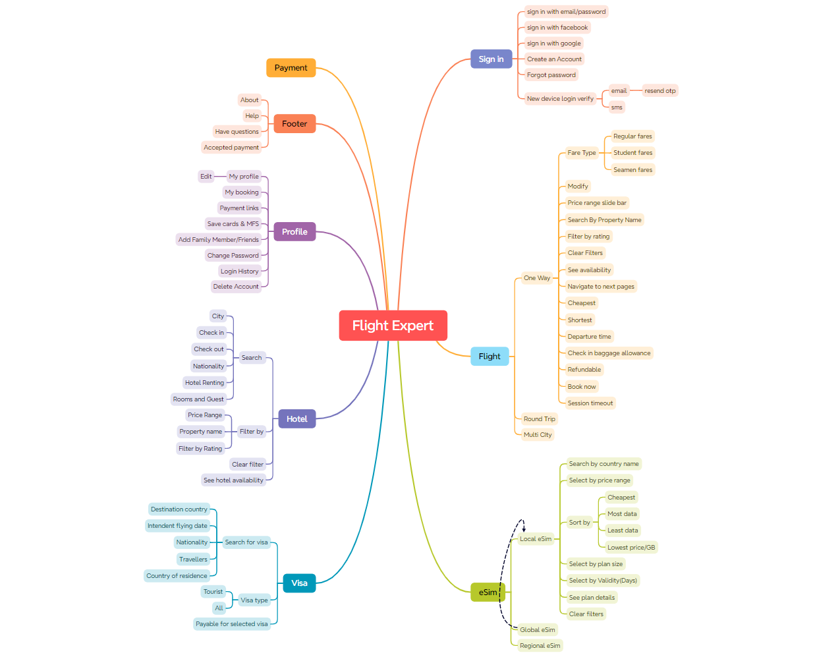

# Flight Expert Automation
### **Website link :** [Flight Expert](https://flightexpert.com/)
## 🚀 Overview
This project is a **Cucumber-based automation framework** using **Selenium and TestNG** for web testing.

- **Test Plan:** [Click here](https://docs.google.com/spreadsheets/d/1rFeV41n414pqqF4WHT-vvRa_Ig6yrAQU/edit?gid=1633991559#gid=1633991559)
- **Test Scenario:** [Click here](https://docs.google.com/spreadsheets/d/1rFeV41n414pqqF4WHT-vvRa_Ig6yrAQU/edit?gid=1411771291#gid=1411771291)
- **Test cases:** [Click here](https://docs.google.com/spreadsheets/d/1rFeV41n414pqqF4WHT-vvRa_Ig6yrAQU/edit?gid=414538291#gid=414538291)

## Mind map:

## 🛠️ Tech Stack
- **Cucumber** (v7.2.3)
- **Selenium WebDriver** (v4.17.0)
- **TestNG** (v7.8.0)
- **Allure Reporting** (v2.24.0)